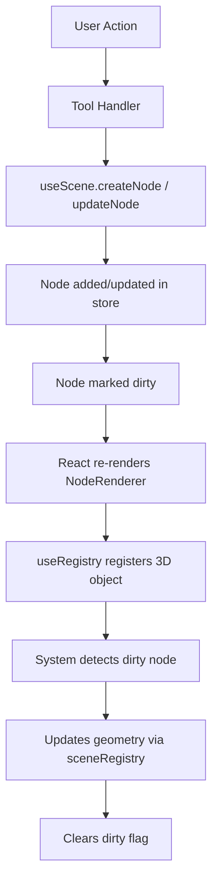

## Overview

The Pascal Editor SDK is built as a **Turborepo monorepo** with clear separation of concerns between packages. This architecture enables reusable 3D rendering components while keeping editor-specific functionality isolated.

## Repository Structure

The monorepo consists of three main packages:

```
editor-v2/
├── apps/
│   └── editor/          # Next.js application
├── packages/
│   ├── core/            # Schema definitions, state management, systems
│   └── viewer/          # 3D rendering components
```

### Package Responsibilities

<CardGroup cols={3}>
  <Card title="@pascal-app/core" icon="cube">
    - Node schemas (Zod)
    - Scene state (Zustand)
    - Systems (geometry generation)
    - Spatial queries
    - Event bus
  </Card>
  
  <Card title="@pascal-app/viewer" icon="eye">
    - 3D rendering via React Three Fiber
    - Default camera/controls
    - Post-processing
    - Node renderers
  </Card>
  
  <Card title="apps/editor" icon="pen-to-square">
    - UI components
    - Interactive tools
    - Selection management
    - Editor-specific systems
  </Card>
</CardGroup>

## Separation of Concerns

The **viewer** package renders the scene with sensible defaults and can be used standalone. The **editor** extends it with interactive tools, selection management, and editing capabilities.

| Package | Responsibility |
|---------|---------------|
| **@pascal-app/core** | Node schemas, scene state (Zustand), systems (geometry generation), spatial queries, event bus |
| **@pascal-app/viewer** | 3D rendering via React Three Fiber, default camera/controls, post-processing |
| **apps/editor** | UI components, tools, custom behaviors, editor-specific systems |

<Note>
This separation allows the viewer to be published as a standalone NPM package for rendering Pascal scenes without editing functionality.
</Note>

## State Management

Each package has its own **Zustand store** for managing state:

### Core Stores

| Store | Package | Responsibility |
|-------|---------|----------------|
| `useScene` | `@pascal-app/core` | Scene data: nodes, root IDs, dirty nodes, CRUD operations. Persisted to IndexedDB with undo/redo via Zundo. |
| `useViewer` | `@pascal-app/viewer` | Viewer state: current selection (building/level/zone IDs), level display mode (stacked/exploded/solo), camera mode. |
| `useEditor` | `apps/editor` | Editor state: active tool, structure layer visibility, panel states, editor-specific preferences. |

### Access Patterns

```typescript
// Subscribe to state changes (React component)
const nodes = useScene((state) => state.nodes)
const levelId = useViewer((state) => state.selection.levelId)
const activeTool = useEditor((state) => state.tool)

// Access state outside React (callbacks, systems)
const node = useScene.getState().nodes[id]
useViewer.getState().setSelection({ levelId: 'level_123' })
```

Location: `packages/core/src/store/use-scene.ts:40-50`

## Data Flow

The architecture follows a unidirectional data flow pattern:



### Flow Example

1. **User Action**: User clicks to create a wall
2. **Tool Handler**: WallTool processes the click
3. **State Update**: `useScene.getState().createNode(wallNode, levelId)`
4. **Marking Dirty**: Node is automatically added to `dirtyNodes` set
5. **Rendering**: React renders `<WallRenderer>` component
6. **Registration**: `useRegistry(node.id, 'wall', ref)` registers the mesh
7. **System Processing**: `WallSystem` detects dirty wall in `useFrame`
8. **Geometry Update**: System generates wall geometry with mitering/CSG
9. **Cleanup**: System clears dirty flag

Location: `packages/core/src/store/actions/node-actions.ts:5-52`

## Technology Stack

The SDK is built with modern web technologies:

- **React 19** + **Next.js 16** - UI framework and application layer
- **Three.js** (WebGPU renderer) - 3D graphics engine
- **React Three Fiber** + **Drei** - React renderer for Three.js
- **Zustand** - State management
- **Zod** - Schema validation
- **Zundo** - Undo/redo middleware for Zustand
- **three-bvh-csg** - Boolean geometry operations (wall cutouts)
- **Turborepo** - Monorepo management
- **Bun** - Package manager and runtime

<Info>
The use of **WebGPU** provides better performance than WebGL, especially for complex scenes with many nodes and geometry operations.
</Info>

## Scene Registry

The registry maps node IDs to their Three.js objects for fast lookup:

```typescript
sceneRegistry = {
  nodes: Map<id, Object3D>,    // ID → 3D object
  byType: {
    wall: Set<id>,
    item: Set<id>,
    zone: Set<id>,
    // ...
  }
}
```

Renderers register their refs using the `useRegistry` hook:

```tsx
const ref = useRef<Mesh>(null!)
useRegistry(node.id, 'wall', ref)
```

This allows systems to access 3D objects directly without traversing the scene graph.

Location: `packages/core/src/hooks/scene-registry/scene-registry.ts`

## Publishing Workflow

The core and viewer packages are published to NPM:

```bash
# Build packages
turbo build --filter=@pascal-app/core --filter=@pascal-app/viewer

# Publish to npm
npm publish --workspace=@pascal-app/core --access public
npm publish --workspace=@pascal-app/viewer --access public
```

<Note>
The editor application is **not** published to NPM - it's deployed separately as a Next.js application.
</Note>
