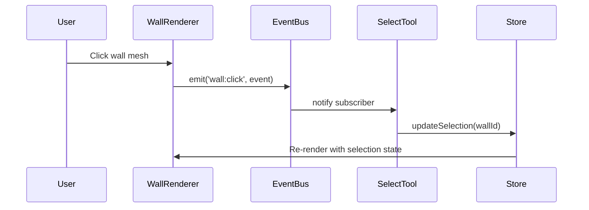

## Overview

The Pascal Editor SDK uses a **typed event bus** based on [mitt](https://github.com/developit/mitt) for inter-component communication. This enables decoupled, event-driven architecture for handling user interactions, camera controls, and tool coordination.

## Event Bus

The event emitter is exported from `@pascal-app/core`:

```typescript
import mitt from 'mitt'
import type { EditorEvents } from './types'

export const emitter = mitt<EditorEvents>()
```

Location: `packages/core/src/events/bus.ts:91`

## Event Types

### Node Events

Node events are fired when users interact with 3D objects:

```typescript
export interface NodeEvent<T extends AnyNode = AnyNode> {
  node: T                              // The node that was interacted with
  position: [number, number, number]   // World-space position
  localPosition: [number, number, number] // Local-space position
  normal?: [number, number, number]    // Surface normal at interaction point
  stopPropagation: () => void          // Prevent event from bubbling
  nativeEvent: ThreeEvent<PointerEvent> // Original R3F event
}
```

Location: `packages/core/src/events/bus.ts:12-19`

#### Type-Specific Events

Each node type has its own event variant:

```typescript
export type WallEvent = NodeEvent<WallNode>
export type ItemEvent = NodeEvent<ItemNode>
export type SiteEvent = NodeEvent<SiteNode>
export type BuildingEvent = NodeEvent<BuildingNode>
export type LevelEvent = NodeEvent<LevelNode>
export type ZoneEvent = NodeEvent<ZoneNode>
export type SlabEvent = NodeEvent<SlabNode>
export type CeilingEvent = NodeEvent<CeilingNode>
export type RoofEvent = NodeEvent<RoofNode>
export type WindowEvent = NodeEvent<WindowNode>
export type DoorEvent = NodeEvent<DoorEvent>
```

Location: `packages/core/src/events/bus.ts:21-31`

### Event Suffixes

All node and grid events support these interaction types:

```typescript
export const eventSuffixes = [
  'click',
  'move',
  'enter',
  'leave',
  'pointerdown',
  'pointerup',
  'context-menu',
  'double-click',
] as const
```

Location: `packages/core/src/events/bus.ts:34-43`

This generates events like:
- `wall:click`
- `item:enter`
- `zone:context-menu`
- `slab:double-click`

### Grid Events

Grid events fire when interacting with empty space (background):

```typescript
export interface GridEvent {
  position: [number, number, number]
  nativeEvent: ThreeEvent<PointerEvent>
}
```

Location: `packages/core/src/events/bus.ts:7-10`

Grid events:
- `grid:click`
- `grid:move`
- `grid:pointerdown`
- etc.

### Camera Control Events

Events for controlling camera behavior:

```typescript
export interface CameraControlEvent {
  nodeId: AnyNode['id']
}

export interface ThumbnailGenerateEvent {
  projectId: string
}

type CameraControlEvents = {
  'camera-controls:view': CameraControlEvent
  'camera-controls:capture': CameraControlEvent
  'camera-controls:top-view': undefined
  'camera-controls:orbit-cw': undefined
  'camera-controls:orbit-ccw': undefined
  'camera-controls:generate-thumbnail': ThumbnailGenerateEvent
}
```

Location: `packages/core/src/events/bus.ts:55-70`

### Tool Events

Events for tool coordination:

```typescript
type ToolEvents = {
  'tool:cancel': undefined
}
```

Location: `packages/core/src/events/bus.ts:72-74`

## Subscribing to Events

### Basic Subscription

```typescript
import { emitter } from '@pascal-app/core/events'

// Subscribe to wall clicks
const handleWallClick = (event: WallEvent) => {
  console.log('Wall clicked:', event.node.id)
  console.log('Position:', event.position)
  console.log('Local position:', event.localPosition)
}

emitter.on('wall:click', handleWallClick)

// Cleanup
emitter.off('wall:click', handleWallClick)
```

### React Hook Pattern

```typescript
import { useEffect } from 'react'
import { emitter } from '@pascal-app/core/events'
import type { WallEvent } from '@pascal-app/core/events'

function WallClickListener() {
  useEffect(() => {
    const handleWallClick = (event: WallEvent) => {
      console.log('Wall clicked:', event.node.id)
    }

    emitter.on('wall:click', handleWallClick)
    return () => emitter.off('wall:click', handleWallClick)
  }, [])

  return null
}
```

### Wildcard Events

```typescript
// Listen to ALL events
emitter.on('*', (type, event) => {
  console.log('Event:', type, event)
})
```

## Emitting Events

### From Renderers

Node renderers emit events on user interactions:

```tsx
import { emitter } from '@pascal-app/core/events'
import type { WallEvent } from '@pascal-app/core/events'

function WallRenderer({ node }: { node: WallNode }) {
  const handleClick = (e: ThreeEvent<PointerEvent>) => {
    e.stopPropagation()

    const event: WallEvent = {
      node,
      position: [e.point.x, e.point.y, e.point.z],
      localPosition: [e.point.x, e.point.y, e.point.z],
      normal: e.face?.normal ? [e.face.normal.x, e.face.normal.y, e.face.normal.z] : undefined,
      stopPropagation: () => e.stopPropagation(),
      nativeEvent: e,
    }

    emitter.emit('wall:click', event)
  }

  return (
    <mesh onClick={handleClick}>
      {/* ... */}
    </mesh>
  )
}
```

### From Tools

```typescript
import { emitter } from '@pascal-app/core/events'

function WallTool() {
  const handleEscape = (e: KeyboardEvent) => {
    if (e.key === 'Escape') {
      emitter.emit('tool:cancel', undefined)
    }
  }

  useEffect(() => {
    window.addEventListener('keydown', handleEscape)
    return () => window.removeEventListener('keydown', handleEscape)
  }, [])
}
```

### Camera Controls

```typescript
import { emitter } from '@pascal-app/core/events'

// Focus camera on a node
emitter.emit('camera-controls:view', { nodeId: buildingId })

// Capture camera position for a node
emitter.emit('camera-controls:capture', { nodeId: levelId })

// Switch to top view
emitter.emit('camera-controls:top-view', undefined)
```

## Event Flow Example

Here's how events flow through the system when a user clicks a wall:



1. User clicks on a wall mesh
2. `WallRenderer` handles the Three.js click event
3. Renderer emits `wall:click` event with node data
4. `SelectTool` (subscribed to wall clicks) receives event
5. Tool updates selection state in store
6. Store triggers re-render with new selection

## Use Cases

### Selection Management

```typescript
import { emitter } from '@pascal-app/core/events'
import useEditor from '@/store/use-editor'

function setupSelectionListeners() {
  emitter.on('wall:click', (event) => {
    useEditor.getState().setSelection(event.node.id)
  })

  emitter.on('item:click', (event) => {
    useEditor.getState().setSelection(event.node.id)
  })

  emitter.on('grid:click', () => {
    useEditor.getState().clearSelection()
  })
}
```

### Context Menus

```typescript
import { emitter } from '@pascal-app/core/events'

function ContextMenu() {
  const [menuState, setMenuState] = useState<{
    position: [number, number]
    nodeId: string
  } | null>(null)

  useEffect(() => {
    const handleContextMenu = (event: WallEvent) => {
      setMenuState({
        position: [event.nativeEvent.clientX, event.nativeEvent.clientY],
        nodeId: event.node.id,
      })
    }

    emitter.on('wall:context-menu', handleContextMenu)
    return () => emitter.off('wall:context-menu', handleContextMenu)
  }, [])

  if (!menuState) return null

  return (
    <div style={{ position: 'fixed', left: menuState.position[0], top: menuState.position[1] }}>
      <button onClick={() => deleteNode(menuState.nodeId)}>Delete Wall</button>
      <button onClick={() => duplicateNode(menuState.nodeId)}>Duplicate Wall</button>
    </div>
  )
}
```

### Hover Highlighting

```typescript
import { emitter } from '@pascal-app/core/events'
import useEditor from '@/store/use-editor'

function setupHoverListeners() {
  emitter.on('wall:enter', (event) => {
    useEditor.getState().setHoveredNode(event.node.id)
  })

  emitter.on('wall:leave', () => {
    useEditor.getState().setHoveredNode(null)
  })
}
```

### Tool Coordination

```typescript
import { emitter } from '@pascal-app/core/events'
import useEditor from '@/store/use-editor'

function WallTool() {
  useEffect(() => {
    const handleCancel = () => {
      // Cancel current operation
      setPreviewWall(null)
      useEditor.getState().setTool('select')
    }

    emitter.on('tool:cancel', handleCancel)
    return () => emitter.off('tool:cancel', handleCancel)
  }, [])

  useEffect(() => {
    const handleEscape = (e: KeyboardEvent) => {
      if (e.key === 'Escape') {
        emitter.emit('tool:cancel', undefined)
      }
    }

    window.addEventListener('keydown', handleEscape)
    return () => window.removeEventListener('keydown', handleEscape)
  }, [])
}
```

## Event Propagation

Events support propagation control:

```typescript
emitter.on('wall:click', (event) => {
  // Handle the event
  console.log('Wall clicked')

  // Stop propagation to prevent parent handlers
  event.stopPropagation()
})

emitter.on('level:click', (event) => {
  // This won't fire if child wall called stopPropagation
  console.log('Level clicked')
})
```

<Info>
The `stopPropagation` function calls the native Three.js event's `stopPropagation`, preventing the event from bubbling up the scene hierarchy.
</Info>

## Best Practices

<CardGroup cols={2}>
  <Card title="Always Cleanup" icon="broom">
    Remove event listeners in cleanup functions to prevent memory leaks
  </Card>
  
  <Card title="Type Safety" icon="shield">
    Use typed event interfaces (`WallEvent`, `ItemEvent`) for type safety
  </Card>
  
  <Card title="Stop Propagation" icon="hand">
    Call `event.stopPropagation()` to prevent unintended parent interactions
  </Card>
  
  <Card title="Minimal Emitters" icon="minimize">
    Only emit events from renderers and core systems, not from UI components
  </Card>
</CardGroup>

<Warning>
**Memory Leaks**: Always clean up event listeners in React `useEffect` return functions or component unmount handlers.
</Warning>
